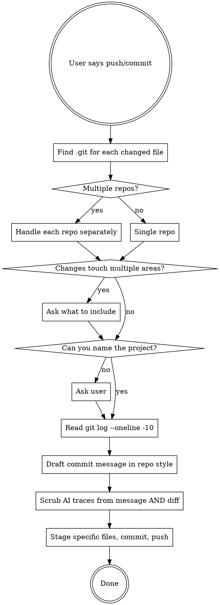

# Git

Commit and push without leaving AI fingerprints.

## Workflow



## Detect the Right Repo

Sub-projects may have their own `.git` (e.g. a website folder inside the vault). Before any git operation:

```bash
git -C <file-directory> rev-parse --show-toplevel
```

If changed files span multiple repos, handle each repo as a separate commit+push.

## Commit Message

Read `git log --oneline -10` from the target repo. Match the existing style exactly: tense, casing, format, length. Do not invent a new convention.

## Scrub AI Traces

Before committing, verify NONE of these appear in the commit message or staged diff:

- `Co-Authored-By: Claude` or any AI co-author line
- "generated by AI/Claude", "assisted by", "with help from"
- Em dashes (AI writing tell)
- Comments like `// AI-generated`, `<!-- Claude -->`, etc.

If any AI trace is found in the diff itself (e.g. a comment you wrote earlier in the session), remove it from the file before staging.

## Scope

- Never `git add -A` or `git add .`. Stage specific files by name.
- If changes touch unrelated areas, ask what to include in this commit.
- If you cannot identify which project the changes belong to, ask before committing.

## Safety

- Never force-push.
- Never amend published commits.
- Never push to a branch you did not create without confirming.
- Never skip hooks (no `--no-verify`).
